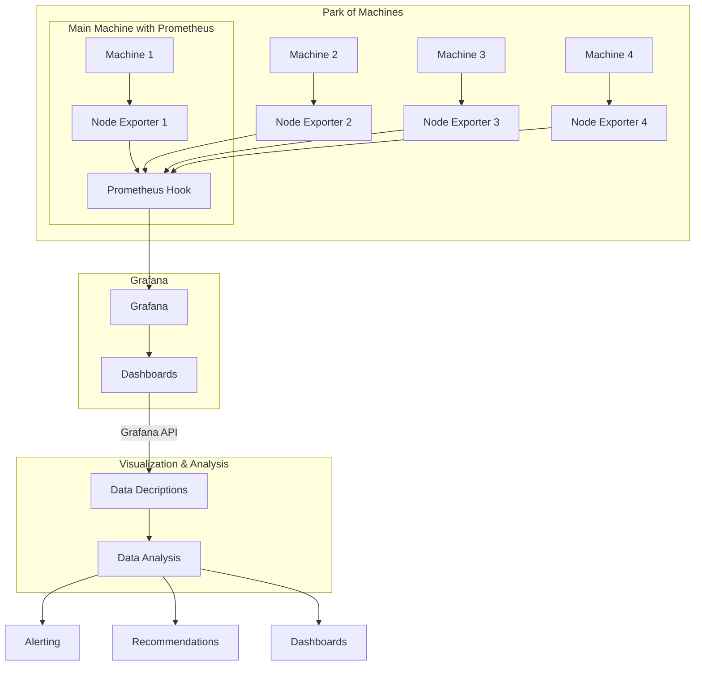

# Project Architecture

## System Design

The system is designed to monitor and analyze the energy consumption of IT infrastructure using Prometheus for data collection and Grafana for data visualization.
The architecture mirrors the following schematic:

