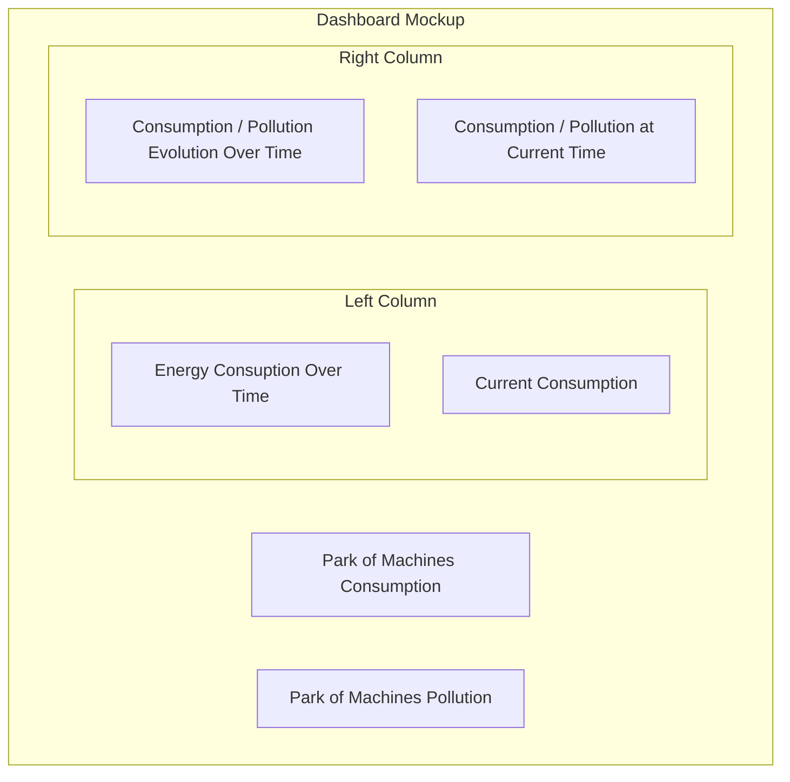

# Project Architecture

## System Design

The system is designed to monitor and analyze the energy consumption of IT infrastructure using Prometheus for data collection and Grafana for data visualization.
The architecture mirrors the following schematic:

## Dashboard Mockup

- consuption / pollution evolution over time
- consuption / pollution at current time
- alerts overview
- average consuption per machine

## Recomandations Report Structure

- summary of key findings
- detailed analysis of energy consumption patterns
- recommendations for optimization
- implementation plan
