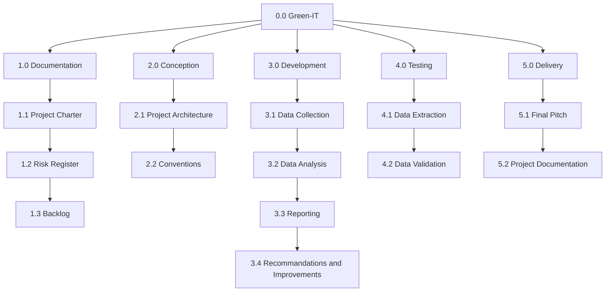

# Work Breakdown Structure (WBS)

```mermaid
graph TD
    A[0.0 Green-IT]

    B[1.0 Documentation]
    C[1.1 Project Charter]
    D[1.2 Risk Register]
    E[1.3 Backlog]

    G[2.0 Conception]
    H[2.1 Project Architecture]
    I[2.2 Conventions]

    J[3.0 Development]
    K[3.1 Data Collection]
    L[3.2 Data Analysis]
    M[3.3 Reporting]
    N[3.4 Recommandations and Improvements]

    O[4.0 Testing]
    P[4.1 Data Extraction]
    Q[4.2 Data Validation]

    R[5.0 Delivery]
    S[5.1 Final Pitch]
    T[5.2 Project Documentation]

    %% Main Structure
    A --> B
    A --> G
    A --> J
    A --> O
    A --> R

    %% Documentation Subtasks
    B --> C
    C --> D
    D --> E

    %% Conception Subtasks
    G --> H
    H --> I

    %% Development Subtasks
    J --> K
    K --> L
    L --> M
    M --> N

    %% Testing Subtasks
    O --> P
    P --> Q

    %% Delivery Subtasks
    R --> S
    S --> T

```