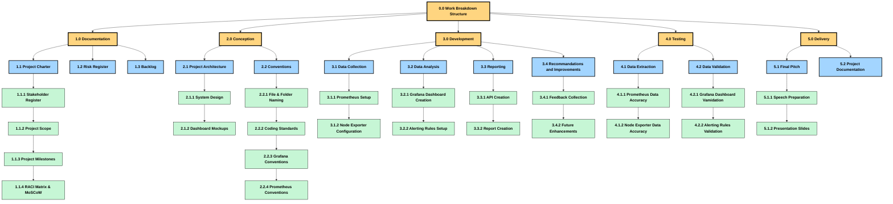

# Work Breakdown Structure (WBS)

```mermaid
graph TD

    %% Styling for depths
    classDef depth1 fill:#FFD580,stroke:#000,stroke-width:3px,color:#000,font-weight:bold;
    classDef depth2 fill:#A3D5FF,stroke:#000,stroke-width:2px,color:#000,font-weight:bold;
    classDef depth3 fill:#C6F6D5,stroke:#000,stroke-width:1px,color:#000,font-weight:bold;

    A[0.0 Work Breakdown Structure]

    B[1.0 Documentation]
    C[1.1 Project Charter]
    D[1.1.1 Stakeholder Register]
    E[1.1.2 Project Scope]
    F[1.1.3 Project Milestones]
    G[1.1.4 RACI Matrix & MoSCoW]
    H[1.2 Risk Register]
    I[1.3 Backlog]

    J[2.0 Conception]
    K[2.1 Project Architecture]
    L[2.1.1 System Design]
    M[2.1.2 Dashboard Mockups]
    N[2.2 Conventions]
    O[2.2.1 File & Folder Naming]
    P[2.2.2 Coding Standards]
    Q[2.2.3 Grafana Conventions]
    R[2.2.4 Prometheus Conventions]

    S[3.0 Development]
    T[3.1 Data Collection]
    U[3.1.1 Prometheus Setup]
    V[3.1.2 Node Exporter Configuration]
    W[3.2 Data Analysis]
    X[3.2.1 Grafana Dashboard Creation]
    Y[3.2.2 Alerting Rules Setup]
    Z[3.3 Reporting]
    AA[3.3.1 API Creation]
    AB[3.3.2 Report Creation]
    AC[3.4 Recommandations and Improvements]
    AD[3.4.1 Feedback Collection]
    AE[3.4.2 Future Enhancements]

    AF[4.0 Testing]
    AG[4.1 Data Extraction]
    AH[4.1.1 Prometheus Data Accuracy]
    AI[4.1.2 Node Exporter Data Accuracy]
    AJ[4.2 Data Validation]
    AK[4.2.1 Grafana Dashboard Vamidation]
    AL[4.2.2 Alerting Rules Validation]

    AM[5.0 Delivery]
    AN[5.1 Final Pitch]
    AO[5.1.1 Speech Preparation]
    AP[5.1.2 Presentation Slides]
    AQ[5.2 Project Documentation]

    class A,B,J,S,AF,AM depth1
    class C,K,H,I,N,T,W,Z,AC,AG,AJ,AN,AQ depth2
    class D,E,F,G,L,M,O,P,Q,R,U,V,X,Y,AA,AB,AD,AE,AH,AI,AK,AL,AO,AP depth3

    %% Main Structure
    A --> B
    A --> J
    A --> S
    A --> AF
    A --> AM

    %% Documentation Subtasks
    B --> C
    C --> D
    D --> E
    E --> F
    F --> G
    B --> H
    B --> I

    %% Conception Subtasks
    J --> K
    K --> L
    L --> M
    J --> N
    N --> O
    O --> P
    P --> Q
    Q --> R

    %% Development Subtasks
    S --> T
    T --> U
    U --> V
    S --> W
    W --> X
    X --> Y
    S --> Z
    Z --> AA
    AA --> AB
    S --> AC
    AC --> AD
    AD --> AE

    %% Testing Subtasks
    AF --> AG
    AG --> AH
    AH --> AI
    AF --> AJ
    AJ --> AK
    AK --> AL

    %% Delivery Subtasks
    AM --> AN
    AN --> AO
    AO --> AP
    AM --> AQ

```
